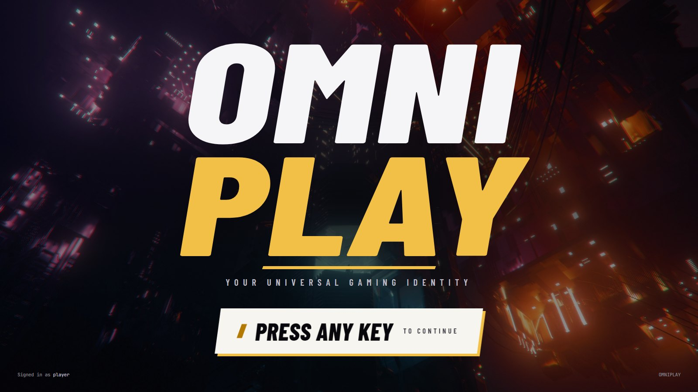

# OMNIPLAY

**One identity. Every game. Your entire gaming history.**

A personal gaming identity platform that unifies what you own, have owned,
played and finished across Steam, Xbox and PlayStation into a single canonical
record — one you control, with every fact traceable to its source.



---

## Quick start

**Requires** Node 22+, pnpm 11+, Docker.

```bash
pnpm install
cp .env.example .env          # then fill in the secrets below
pnpm infra:up                 # Postgres + Redis
pnpm db:push && pnpm db:seed  # schema, extensions, trigram indexes, platforms
```

Generate the two required secrets:

```bash
openssl rand -base64 32   # SESSION_SECRET
openssl rand -base64 32   # CREDENTIAL_ENCRYPTION_KEY
```

Then start everything and open <http://localhost:3000>:

```bash
pnpm dev        # API (:4000), worker, web (:3000)
```

Create an account and connect a platform from Settings. Everything else in
`.env` is optional and named in `.env.example`: provider credentials, IGDB
metadata, Google sign-in, and a Resend key for password-reset email.
`pnpm doctor` reports which are set and what each missing one costs you.

**Nothing appears until you connect a real account.** To exercise the app with
no credentials at all, seed a fixture library through the real pipeline:

```bash
pnpm --filter @omniplay/worker demo your@email.com   # a fake Steam library
pnpm --filter @omniplay/worker demo:enrich           # fake IGDB metadata
pnpm --filter @omniplay/worker reset your@email.com --connections   # clear it
```

---

## Running it day to day

```bash
pnpm infra:up   # Postgres + Redis, if not already running
pnpm dev        # all three processes
pnpm doctor     # what is configured, and what each gap costs
```

To watch one process closely, run it alone: `pnpm --filter @omniplay/api dev`,
`… /worker dev`, `… /web dev`. `pnpm infra:down` stops the containers without
deleting data — the database lives in a Docker volume, so a restart keeps
everything that was synced.

### When something does not work

**The library is empty, or a sync never finishes.** The worker is not running.
It has no port and prints little, so it is the easy one to miss. A `SyncJob`
row stuck at `QUEUED` means exactly that.

**A sync behaves as though your code changes did nothing.** Either a second
worker is still running (both consume the same queue, so an old build answers
at random — closing a terminal does not always kill the process), or a
workspace package needs rebuilding: the API and worker import
`@omniplay/providers` from its compiled `dist/`, and the `dev` scripts watch
their own app, not their dependencies.

**A change to `.env` seems ignored.** The API reads that file once, at startup.
Restart it. `pnpm doctor` reads `.env` directly, so it can disagree with a
running process — which is itself the clue.

**A sync is stuck on "running".** A worker killed mid-sync cannot return to the
job. The worker reconciles those at startup: anything still marked running two
hours on is failed with `INTERRUPTED` and an explanation.

**PlayStation stops working after a couple of months.** The npsso is a browser
session token, not an API key, and Sony expires it. Sign in at playstation.com,
reopen <https://ca.account.sony.com/api/v1/ssocookie>, and replace `PSN_NPSSO`.

---

## Accounts

Sign in with a password or with Google. Password sign-in always works; the
Google button is live only when the instance has credentials for it.

| | What you need | Without it |
|---|---|---|
| **Password** | Nothing | — |
| **Google** | OAuth client from [Google Cloud](https://console.cloud.google.com) → `GOOGLE_CLIENT_ID` / `GOOGLE_CLIENT_SECRET`, with `<API_URL>/auth/google/callback` as an authorised redirect URI | Button is greyed out |
| **Email** *(password reset)* | [Resend](https://resend.com) key → `RESEND_API_KEY`, and `MAIL_FROM` on a domain you have verified | Reset links go to the API log, and the reset screen says so |

Google accounts are matched on Google's `sub`, never on the email address: an
address can be reassigned, and treating it as identity would hand the new owner
someone else's account. An address Google will not vouch for is used for
nothing. An account opened through Google has no password; signing in with one
says so and points at the Google button or the reset flow.

**Password reset.** Links are single use, expire in an hour, and destroy every
other session when consumed. The request form says what happened — link sent to
the named address, no account under it, asked again within a minute, or a mail
provider that refused, in which case nothing was sent and it says so. Naming a
missing account also lets a stranger test addresses, so requests are metered
per caller (ten in fifteen minutes) and per address (one a minute).

Resend's default sender, `onboarding@resend.dev`, only delivers to the address
that owns the Resend account, so the first test works and every later one
silently does not. Check the whole path in one command:

```bash
pnpm --filter @omniplay/api mail:test you@example.com
pnpm --filter @omniplay/api password set you@example.com   # local escape hatch
```

---

## Provider credentials

None are required to boot. A provider is offered only when configured, so a
Steam-only instance works fine.

| Platform | How it connects | What you need |
|---|---|---|
| **Steam** | Real API | [Web API key](https://steamcommunity.com/dev/apikey) → `STEAM_API_KEY`. Your profile *and* "Game details" must be Public |
| **Xbox** | Real API | [OpenXBL key](https://xbl.io) → `OPENXBL_API_KEY` (no Azure needed), *or* an Azure app → `XBOX_CLIENT_ID` |
| **PlayStation** | Unofficial API, *or* file import | Session token from [ssocookie](https://ca.account.sony.com/api/v1/ssocookie) → `PSN_NPSSO`. Expires every ~60 days |
| **Ubisoft Connect** | File import | No public API; community endpoints need your password, which we will not ask for |
| **EA** | File import | No public API for the EA app |
| **Manual entry** | File import | Physical copies, retro consoles, anything else |
| **IGDB** *(metadata)* | Real API | [Twitch app](https://dev.twitch.tv/console/apps) → `IGDB_CLIENT_ID`/`SECRET`. Optional but strongly recommended |

For the import platforms, request a personal-data export from the platform
itself (Settings links to each), or write the CSV by hand. Ubisoft and EA
titles bought *through Steam* already arrive with your Steam library. Games
that arrive before IGDB is configured are not stranded — the **Data quality**
screen backfills their metadata afterwards.

> Steam will not return your library unless **Game details** is set to Public.
> OMNIPLAY detects this and says so rather than reporting zero games.

---

## Architecture

Modular monolith, background workers, provider adapter layer.

```
apps/
  web/       Next.js 15 — server components, Tailwind 4
  api/       NestJS 11 — REST, sessions, provider connect flows
  worker/    BullMQ — sync jobs, ingestion, entity resolution
packages/
  database/       Prisma schema + credential encryption
  types/          Provider contract, domain vocabulary, queue contract
  providers/      Steam, Xbox, PlayStation, IGDB adapters + rate limiting/retry/circuit breaker
  game-matching/  Title normalisation + 5-level canonical resolution
  statistics/     Playtime and library aggregation
  config/         Shared TypeScript configuration
```

The API never talks to a provider inside a request: a sync writes a `SyncJob`
row, queues a job, and returns. The worker does the fetching, so a full library
import never holds a request open.

[docs/codebase-guide.md](docs/codebase-guide.md) walks every file in the
repository.

### Three ideas the rest follows from

**1. Providers are data sources, not the database.** Every adapter implements
one `GamingProvider` interface. Nothing downstream — matching, statistics, UI —
knows whether a record came from Steam or Xbox. `provider` is a `String`
column, never an enum, so adding Epic is a row rather than a migration.

**2. Ownership, activity and achievements are separate facts.** A game you own
but never launched, a game you played at a friend's house, and a game you have
achievements in but never bought are three different things. Xbox's title
history proves *activity*, not entitlement — so it creates no ownership rows.
Ownership is never deleted either: a game that leaves your library keeps its
row with a `removedAt` date.

**3. Provenance travels with the data.** Every meaningful row carries a source,
a confidence level, and an observation time. The UI surfaces it: a figure
derived from achievement history does not look identical to one Steam stated
outright.

### Entity resolution

The piece most likely to quietly corrupt everything, so it is layered:

| Level | Method | Confidence |
|---|---|---|
| 1 | Known provider id → canonical game | `VERIFIED` |
| 2 | IGDB store-id mapping | `VERIFIED` |
| 3 | Exact normalised title | `DERIVED` |
| 4 | Trigram-ranked fuzzy match | `DERIVED` |
| 5 | Queued for human review | — |

The normaliser draws a hard line between **edition** markers (packaging of the
same game — "Deluxe", "GOTY") which are stripped, and **version** markers
(a different product — "Remake", "Remastered", "VR") which are preserved and
block a merge outright. Ambiguous markers are classed as versions, because a
false split is one admin click to fix and a false merge silently pools two
games' history forever.

### Playtime arithmetic

Steam reports a **lifetime total it overwrites on every sync**, not an event.
Summing observations would inflate your hours every time you press Sync. But
the same game on Steam and PlayStation is two real playthroughs that *should*
add.

The rule: **max per `(game, provider)`, then sum across providers.** It lives in
`packages/statistics` with tests covering both directions. Playtime that cannot
be dated is never split across years — which is why the year table has no hours
column.

### The interface

Signing in lands on a title screen (`/boot`, above), which leads to a main menu
of nine cards — one per screen, each with its own art. There is no sidebar:
the menu is the navigation, and every page wears one thin bar with a way back
to it. That route — title, menu, screen — changes behind a curtain, kept
quicker than the rest of the app's motion because it is the one people take
constantly; an ordinary navigation keeps the slower arrival. On a device with
a mouse the pointer is the app's own gold arrowhead.

Both are settings. **Settings → Interface** switches animation off entirely and
hands the pointer back to the system. They are per device rather than per
account, stored in `localStorage` and applied before the first paint, so the
first frame never animates against the setting. A system
`prefers-reduced-motion` wins over both.

The design system lives in `apps/web/src/app/globals.css`; the backdrop is a
still (`public/backdrop/city.jpg`, by [@nattgw](https://unsplash.com/@nattgw)
under the Unsplash licence) that becomes a looping video if you drop an `.mp4`
in beside it.

---

## Testing

```bash
pnpm test        # all packages
pnpm typecheck
```

Provider parsers run against sanitised contract fixtures
(`packages/providers/fixtures/`) on every CI run, so a changed upstream
response shape surfaces there rather than in someone's playtime total.

---

## PlayStation

Sony publishes no consumer API, so PlayStation talks to the endpoints behind
the PlayStation mobile app, authenticated with an `npsso` session token you
paste in yourself. That is a deliberate exception, and it costs:

- It is unofficial, and Sony can change or close those endpoints at any time.
- The `npsso` is a **session credential, not an API key**. Anyone holding it can
  act as you on PSN. It is stored only in `.env`, which is gitignored.
- It expires roughly every 60 days and has to be replaced by hand.

What it buys is the richest data in the app: per-title durations *with* first
and last played dates, play counts, and individually dated trophy unlocks.
Steam reports a lifetime total with no dates at all, so PlayStation is the only
provider that can say *when* a game was played rather than merely how long.

Ownership is inferred from Sony's `service` field, which distinguishes store
titles from discs and pre-installs — so those rows are `DERIVED`, not
`VERIFIED`. Leave `PSN_NPSSO` unset and PlayStation falls back to file import.

### Importing PlayStation and physical copies

Settings → PlayStation also takes a CSV or JSON file, the route for physical
copies, retro consoles, and anything else no API knows about:

```csv
Title,Platform,Hours,Status,Ownership,Acquired
Bloodborne,PS4,62.5,Completed,Physical,2015-03-24
Ghost of Tsushima,PS4,55,Playing,Digital,2020-07-17
```

Only `Title` is required. The parser is forgiving about column naming and hour
notation (`12h`, `1.5`, `3:30`), reports bad rows rather than rejecting the
file, and refuses ambiguous dates like `01/02/2024` instead of guessing.
Everything imported is marked `DECLARED`. Imports run through the *same*
pipeline as API-backed providers, so a PlayStation copy of a game you also own
on Steam lands on one game page with both platforms' hours shown separately.

---

## Data quality

Automatic matching is tuned to **defer rather than guess**, so a queue of
decisions accumulates by design. `/admin` drains it. Grant yourself access:

```sql
UPDATE "User" SET "isAdmin" = true WHERE email = 'you@example.com';
```

It covers unresolved provider records (map / create / ignore, given equal
prominence so the top suggestion is not the reflex), games without metadata,
possible duplicates grouped by normalised title, and recent sync failures.
Metadata enrichment runs on its own queue, so a 500-game backfill never delays
someone pressing Sync.

```bash
pnpm --filter @omniplay/worker demo:enrich   # the real path, stubbed IGDB
```

---

## Status

Implemented: the canonical model and provider abstraction; Steam, Xbox and
PlayStation (live API, with file import as the fallback) plus manual entry;
IGDB metadata and enrichment; entity resolution with the admin mapping queue,
duplicate detection and game merging; the sync pipeline with rate limiting and
circuit breaking; accounts with Google sign-in and password reset; and the
screens — dashboard, library, game pages, timeline, achievements, statistics,
collections, public profiles, settings.

Not yet: Gaming Wrapped, more platforms (Epic, GOG), achievement detail pages,
and sign-in by phone.

### A note on Xbox

Two adapters satisfy the same interface. **OpenXBL** needs only an API key; the
**direct** route needs an Azure app registration, which a personal Microsoft
account cannot create. The registry prefers OpenXBL when its key is present,
and nothing downstream can tell which answered.

Xbox gives **achievements and evidence of play, not a library** — title history
is achievement-derived. Playtime lives in a per-title stats collection, one
request per game, and OpenXBL's free tier allows 150 requests an hour. So each
sync covers a bounded number of titles, ordered by when each was last asked;
run a sync a few times to fill a library in.

---

Two documents go deeper than this one:
[docs/architecture.md](docs/architecture.md) for the decisions behind the code,
and [docs/feasibility.md](docs/feasibility.md) for what each platform will
actually tell you.

**Windows note.** `prisma generate` cannot replace its query-engine DLL while a
Node process has it loaded. If a build fails with `EPERM … query_engine-windows.dll.node`,
stop the API and worker first.

## Licence

MIT
